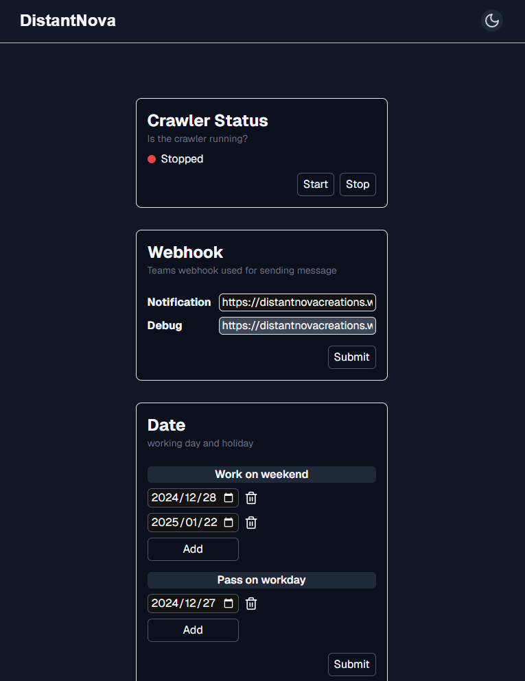
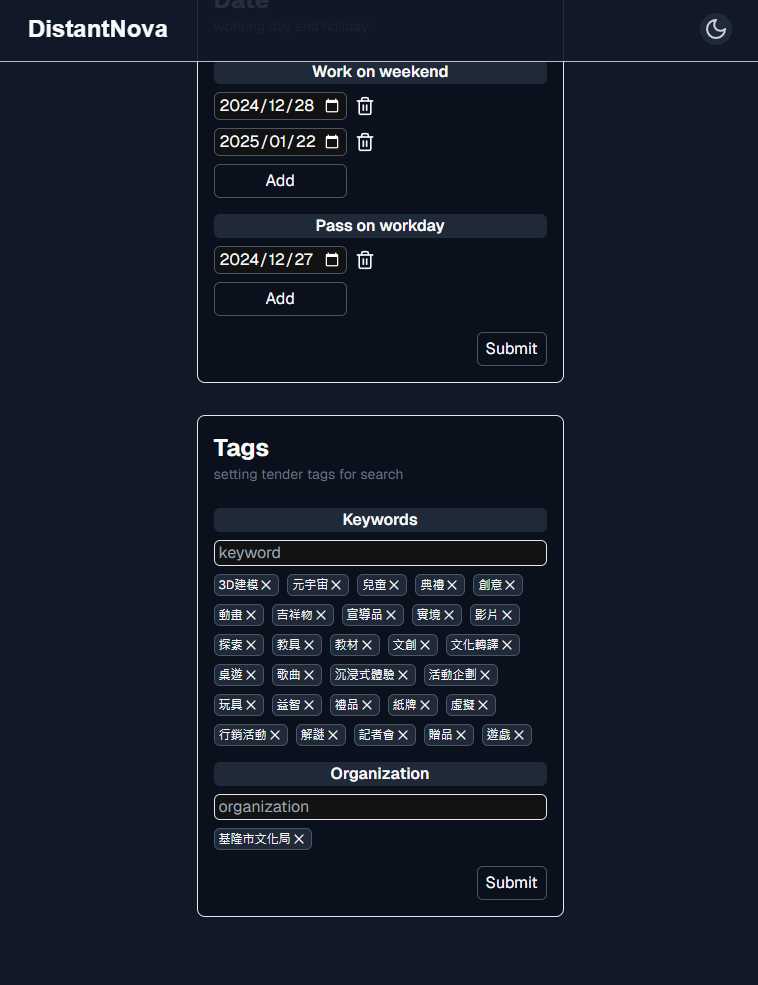

# Tender List

## Description

這個專案來自於好友的需求，可以定時檢查最新的[政府標案](https://web.pcc.gov.tw/prkms/tender/common/basic/indexTenderBasic)並發送通知至Teams頻道。

專案核心是APScheduler的進階運用，雖然技術層面並不複雜，但藉此機會重新架構了[舊的專案](https://github.com/AilentDE/Moaideas/tree/master/tender_project)的結構。

資料庫採用SQLite3，不需要額外啟動資料庫伺服器。

並且以Next.js開發了前端介面（雖然以這專案而言有點過重了）讓使用者能夠靈活調整設定，並透過Server Action實現端點保護機制。

有興趣歡迎參考使用，也可以依需求自行加入Proxy來提升爬蟲作業的穩定性。

## Screenshots





## Usage

1.  準備 `.env` 檔案

    ```bash
    # 後端端點
    API_URL=
    ```

2.  啟動服務

    ```bash
    # 前端
    npm install
    npm run dev
    ```

3.  部屬容器，我準備了兩種docker-compose文件依照實際需求自行使用
    (我是以windows開發並部署到ubuntu server)

    1. Windows Docker Desktop

       ```bash
       docker-compose up -d
       ```

    2. Linux

       ```bash
       docker-compose -f docker-compose-linux.yml up -d
       ```
